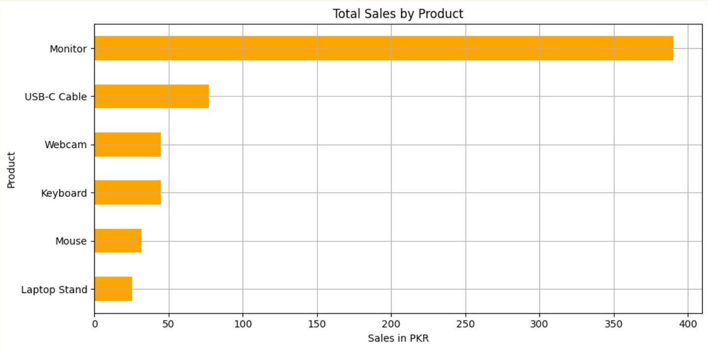

# 📊 Sales Data Cleaning and Analysis

This project focuses on cleaning and analyzing sales data using Python and Pandas. The goal is to derive meaningful insights from raw sales data and present them in a structured and visually understandable way.

---

## 🧰 Tools and Libraries Used

- Python 🐍
- Pandas 🐼
- Matplotlib 📈
- Jupyter Notebook 📒

---

## 🧹 Data Cleaning Process

- Removed null values
- Renamed columns for consistency
- Corrected data types
- Removed duplicates
- Handled formatting issues in dates and prices

---

## 📊 Analysis Performed

- Monthly sales trend
- Top-selling products
- Sales by region/city
- Product-wise revenue comparison
- Customer purchase patterns (if applicable)

---

## 📎 Files Included

- `sales_data_messy.csv`: Original uncleaned data
- `sales_data_cleaned.csv`: Cleaned version of dataset
- `sales_data_cleaning_and_analysis.ipynb`: Main Jupyter Notebook
- `sales_data_cleaning_and_analysis.pdf`: PDF version for preview
- `sales_data_cleaning_and_analysis.html`: HTML version for browser viewing

---

## 📸 Sample Visualizations

> 

---

## 🔑 Key Insight – Total Sales by Product
Monitor stands out as the top-selling product, with total sales reaching close to 380 units, indicating it’s in high demand and likely a primary revenue driver.

USB-C Cable and Webcam follow, showing moderate sales between 75–80 and 40–45 units respectively, suggesting consistent consumer need.

Products like Keyboard, Mouse, and Laptop Stand had relatively lower sales, with totals ranging from 25 to 35 units, possibly due to lower demand or niche use cases.

This breakdown can help prioritize inventory restocking, promotions, or bundling strategies around high-performing products like Monitors and Cables.

---

## 🚀 Future Improvements

- Add interactive dashboards (e.g., using Plotly or Power BI)
- Include customer segmentation analysis
- Automate monthly report generation

---

## 👤 Author

**Mueen Ud Din**  
Aspiring Data Scientist | Python Enthusiast | Lifelong Learner  
🔗 [GitHub Profile](https://github.com/mueen-ds)

---
